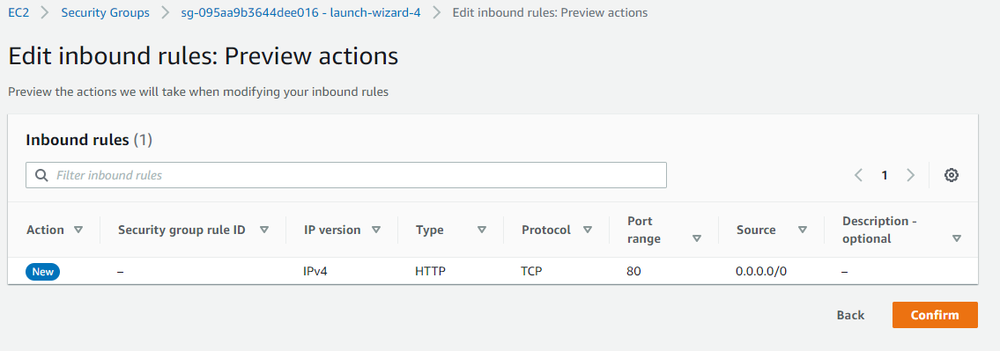
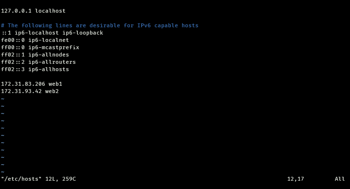
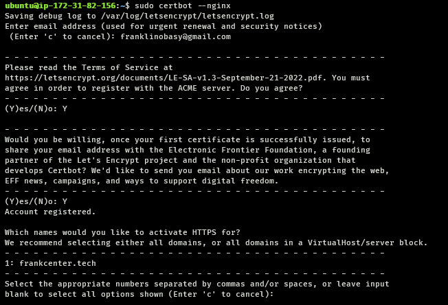

# Load Balancer Solution With Nginx and SSL/TLS

In order to get a valid SSL certificate – you need to register a new domain name, you can do it using any Domain name registrar – a company that manages reservation of domain names. The most popular ones are: Godaddy.com, Domain.com, Bluehost.com.

## STEP 1 - Register a Domain
Register a new domain name with any registrar of your choice in any domain zone (e.g. .com, .net, .org, .edu, .info, .xyz or any other)


## STEP 2 - Assign an Elastic IP to your Nginx LB server and associate your domain name with this Elastic IP

1. Spin an EC2 instance (Based on Ubuntu)
   

2. Open TCP port 80 on Project-8-apache-lb by creating an Inbound Rule in Security Group.
   

3. connect to the instance via ssh and Install Nginx
   ```
   sudo apt update
   sudo apt install nginx
   ```
4. Make sure the nginx is running
   ```
   sudo systemctl status nginx
   ```
   

5. Add the Private IP addresses of the webservers as web1 and web2 respectively in `/etc/hosts`
   ```
   sudo vi /etc/hosts
   ```
   

6. configure nginx configuration file
   ```
   sudo vi /etc/nginx/nginx.conf
   ```

   Add the following with the http scope:
   ```
   upstream myproject {
        server web1 weight=5;
        server web2 weight=5;
   }

   ```
  Then add this within the server scope of `/etc/nginx/sites-available/default`
  ```
  sudo vi  /etc/nginx/sites-available/default
  ```
  ```
  server_name www.domain.com;

  location / {
        # First attempt to serve request as file, then
        # as directory, then fall back to displaying a 404.
        proxy_pass http://myproject;
  }
  ```

7. Assign an Elastic IP to your Nginx LB server and associate your domain name with this Elastic IP
   You might have noticed, that every time you restart or stop/start your EC2 instance – you get a new public IP address. When you want to associate your domain name – it is better to have a static IP address that does not change after reboot. Elastic IP is the solution for this problem.
   - Create an Elastic IP
    In the EC2 side panel, go to `Network & Security`, then click `ELastic IPs`
    
   - click `Allocate Elastic IP address`
   - Make sure the `Network Border Group` is set to the same Availability Zone as the nginx server
   - You can optionally add a tag
   - click `Allocate`
    
   - Select the newly created Elastic IP address, click `Actions`, then select `Associate Elastic IP address`
    
   - In the `instance` field, select the nginx LB server instance, and `Private IP address` field, select the private IP address of the nginx LB server instance.
   - click `Associate`

8. Update `A record` in your registrar to point to Nginx LB using Elastic IP address

9. Configure Nginx to recognize your new domain name
   Update your `/etc/nginx/sites-available/default` with server_name www.<your-domain-name.com> instead of server_name www.domain.com
   

10. Install certbot and request for an SSL/TLS certificate
    - Make sure snapd service is active and running
    ```
    sudo systemctl status snapd
    ```
    - Install certbot
    ```
    sudo snap install --classic certbot
    ```
    - Request your certificate (just follow the certbot instructions – you will need to choose which domain you want your certificate to be issued for, domain name will be looked up from `nginx.conf` file so make sure you have updated it on step 9).
    ```
    sudo ln -s /snap/bin/certbot /usr/bin/certbot
    sudo certbot --nginx
    ```
    

    

    Test secured access to your Web Solution by trying to reach https://<your-domain-name.com>

   You shall be able to access your website by using HTTPS protocol (that uses TCP port 443) and see a padlock pictogram in your browser’s search string.
   Click on the padlock icon and you can see the details of the certificate issued for your website.
   

11. Set up periodical renewal of your SSL/TLS certificate
    By default, LetsEncrypt certificate is valid for 90 days, so it is recommended to renew it at least every 60 days or more frequently.

    You can test renewal command in `dry-run` mode

    ```
    sudo certbot renew --dry-run
    ```

    

    Best pracice is to have a scheduled job that to run renew command periodically. Let us configure a cronjob to run the command twice a day.

    To do so, lets edit the crontab file with the following command:
    ```
    crontab -e
    ```

    Add following line:
   ```
    * */12 * * *   root /usr/bin/certbot renew > /dev/null 2>&1
   ```
    You can always change the interval of this cronjob if twice a day is too often by adjusting schedule expression.
