# INSTALL AND CONFIGURE ANSIBLE ON EC2 INSTANCE

## Step 1

1. Update `Name` tag on your `Jenkins` EC2 Instance to `Jenkins-Ansible`. We will use this server to run playbooks.
   

2. In your GitHub account create a new repository and name it `ansible-config-mgt`
   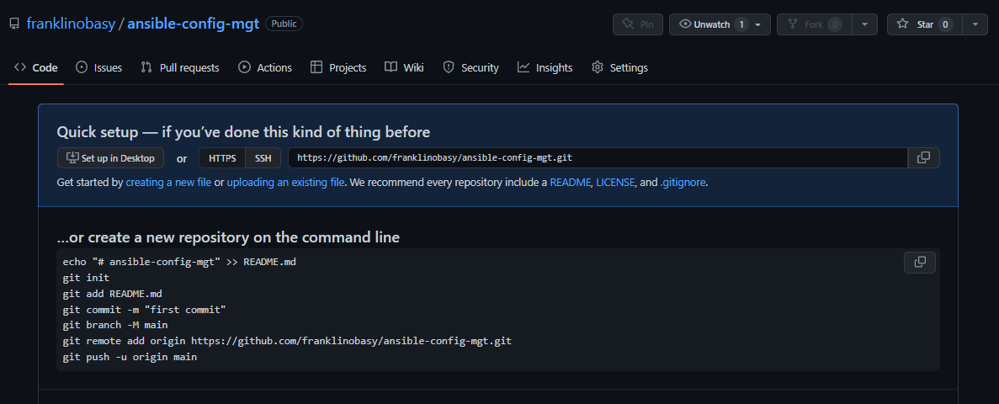

3. Instal Ansible
   ```
   sudo apt update
   sudo apt install ansible
   ```

   Check your Ansible version by running 
   ```
   ansible --version
   ```
   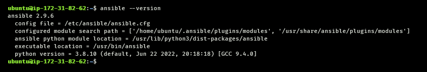

4. Configure Jenkins build job to save your repository content every time you change it – this will solidify your   Jenkins configuration skills acquired in [Project 9](https://github.com/franklinobasy/Devops/blob/main/project9.md)
   - Create a new Freestyle project ansible in Jenkins and point it to your ‘ansible-config-mgt’ repository.
   - Configure Webhook in GitHub and set webhook to trigger ansible build.
   - Configure a Post-build job to save all (**) files, like you did it in Project 9.

5. Test your setup by making some change in README.MD file in master branch and make sure that builds starts automatically and Jenkins saves the files (build artifacts) in following folder
   ```
   /var/lib/jenkins/jobs/ansible/builds/<build_number>/archive/
   ```

   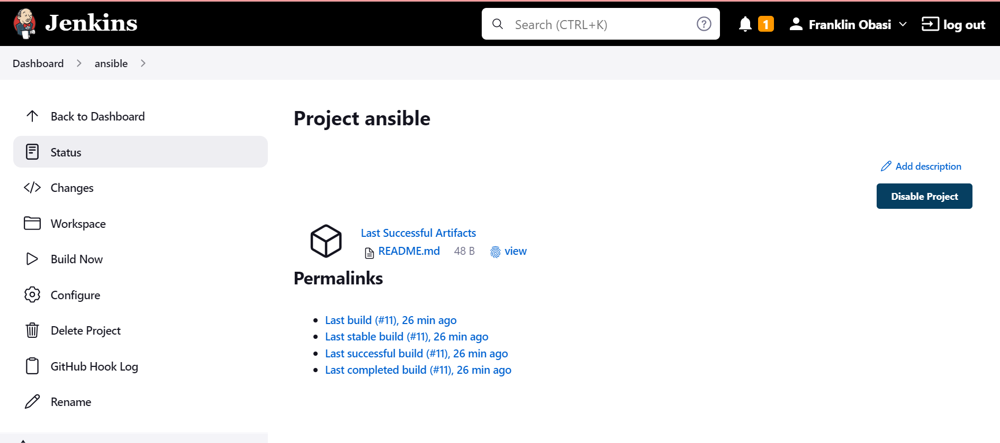

   

*Note*: Trigger Jenkins project execution only for /main (master) branch.

*Tip* Every time you stop/start your Jenkins-Ansible server – you have to reconfigure GitHub webhook to a new IP address, in order to avoid it, it makes sense to allocate an Elastic IP to your Jenkins-Ansible server (you have done it before to your LB server in Project 10). Note that Elastic IP is free only when it is being allocated to an EC2 Instance, so do not forget to release Elastic IP once you terminate your EC2 Instance.


## Step 2 - Prepare your development environment
1. Clone down your ansible-config-mgt repo to your Jenkins-Ansible instance
   ```
   git clone <ansible-config-mgt repo link>
   ```

## Step 3 - Begin Ansible Development
1. In your ansible-config-mgt GitHub repository, create a new branch that will be used for development of a new feature.
2. Checkout the newly created feature branch to your local machine and start building your code and directory structure
   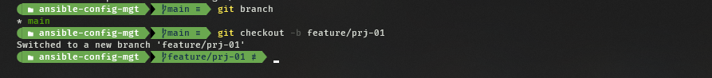

3. Create a directory and name it `playbooks` – it will be used to store all your playbook files.
4. Create a directory and name it inventory – it will be used to keep your hosts organised.
5. Within the playbooks folder, create your first playbook, and name it `common.yml`
6. Within the inventory folder, create an inventory file (.yml) for each environment (Development, Staging Testing and Production) `dev`, `staging`, `uat`, and `prod` respectively.
   
   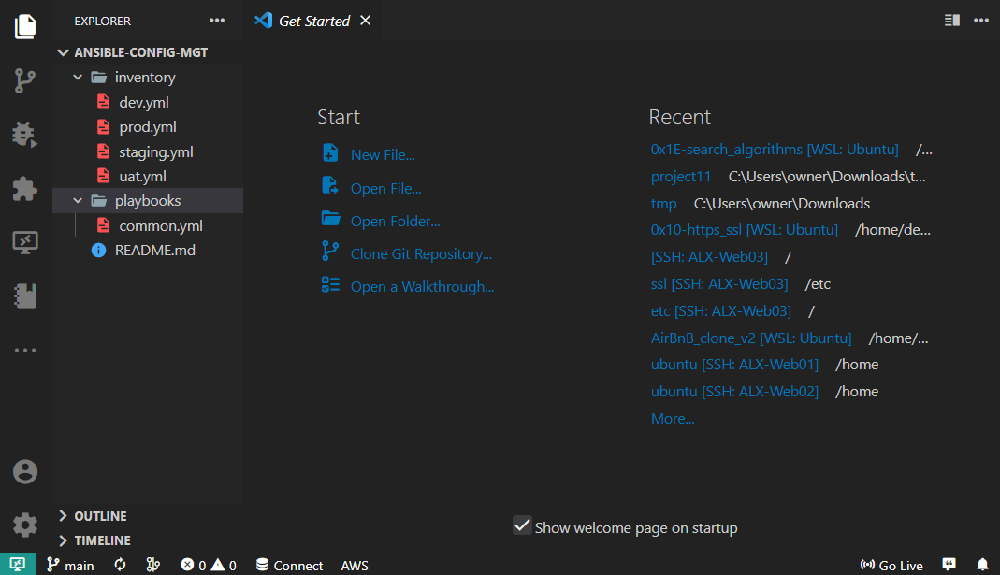


## Step 4
An Ansible inventory file defines the hosts and groups of hosts upon which commands, modules, and tasks in a playbook operate. Since our intention is to execute Linux commands on remote hosts, and ensure that it is the intended configuration on a particular server that occurs. It is important to have a way to organize our hosts in such an Inventory.

Save below inventory structure in the `inventory/dev` file to start configuring your development servers. Ensure to replace the IP addresses according to your own setup.

Update your `inventory/dev.yml` file with this snippet of code:
```
[nfs]
<NFS-Server-Private-IP-Address> ansible_ssh_user='ec2-user'

[webservers]
<Web-Server1-Private-IP-Address> ansible_ssh_user='ec2-user'
<Web-Server2-Private-IP-Address> ansible_ssh_user='ec2-user'

[db]
<Database-Private-IP-Address> ansible_ssh_user='ec2-user' 

[lb]
<Load-Balancer-Private-IP-Address> ansible_ssh_user='ubuntu'
```

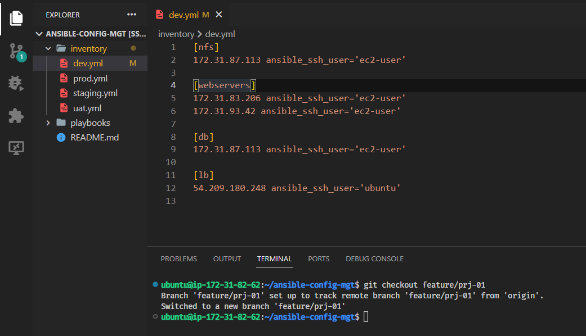

## Step 5 - Create a Common Playbook
In common.yml playbook you will write configuration for repeatable, re-usable, and multi-machine tasks that is common to systems within the infrastructure.

Update your playbooks/common.yml file with following code:

```
---
- name: update web, nfs and db servers
  hosts: webservers, nfs, db
  remote_user: ec2-user
  become: yes
  become_user: root
  tasks:
    - name: ensure wireshark is at the latest version
      yum:
        name: wireshark
        state: latest

- name: update LB server
  hosts: lb
  remote_user: ubuntu
  become: yes
  become_user: root
  tasks:
    - name: Update apt repo
      apt: 
        update_cache: yes

    - name: ensure wireshark is at the latest version
      apt:
        name: wireshark
        state: latest
```

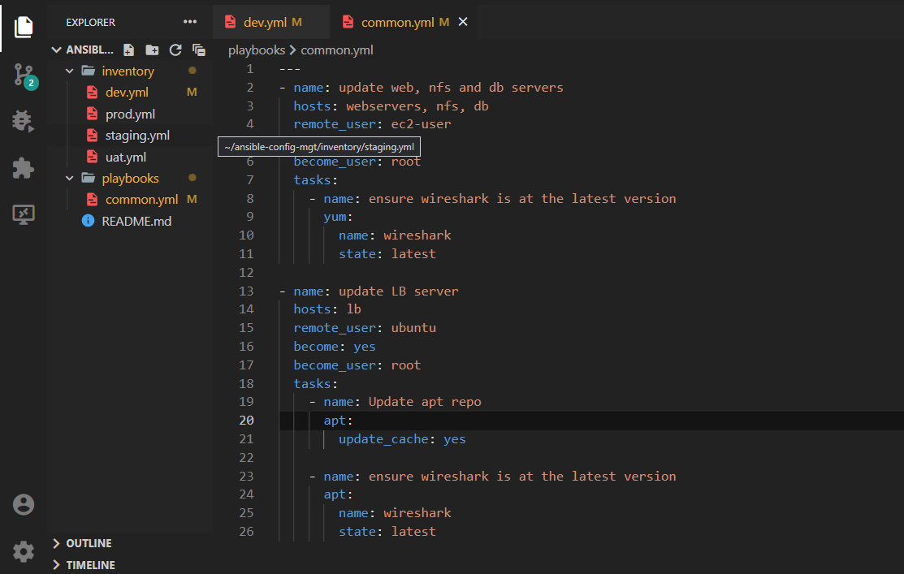

## Step 6 – Update GIT with the latest code
1. use git commands to add, commit and push your branch to GitHub.
   ```
   git status

   git add <selected files>

   git commit -m "commit message"
   ```
2. Create a Pull request (PR)
3. Wear a hat of another developer for a second, and act as a reviewer.

4. If the reviewer is happy with your new feature development, merge the code to the master branch.

5. Head back on your terminal, checkout from the feature branch into the master, and pull down the latest changes.
   
   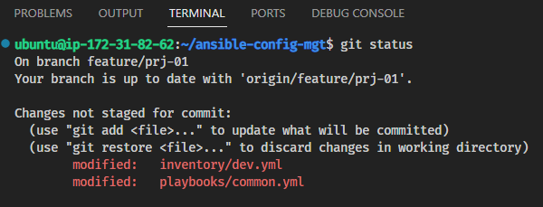

   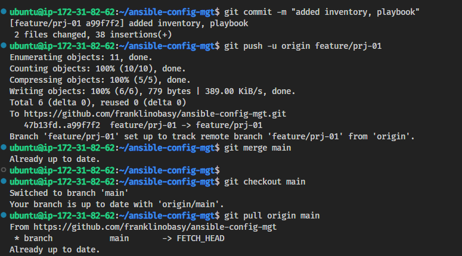
   
   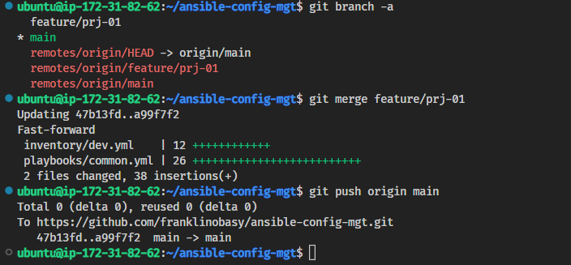

Once your code changes appear in master branch – Jenkins will do its job and save all the files (build artifacts) to /var/lib/jenkins/jobs/ansible/builds/<build_number>/archive/ directory on Jenkins-Ansible server.

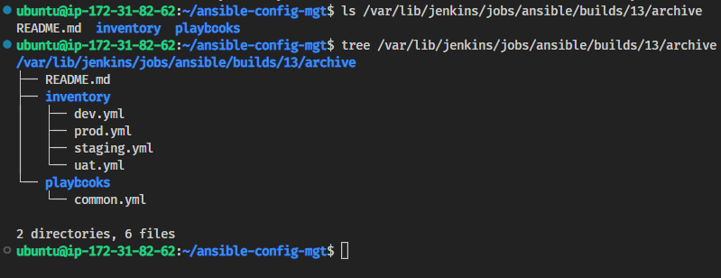

## Step 7 - Run first Ansible test
Now, it is time to execute ansible-playbook command and verify if your playbook actually works:

Run the following codes
```
cd ansible-config-mgt
ansible-playbook -i inventory/dev.yml playbooks/common.yml
```


You can go to each of the servers and check if wireshark has been installed by running `which wireshark` or `wireshark --version`

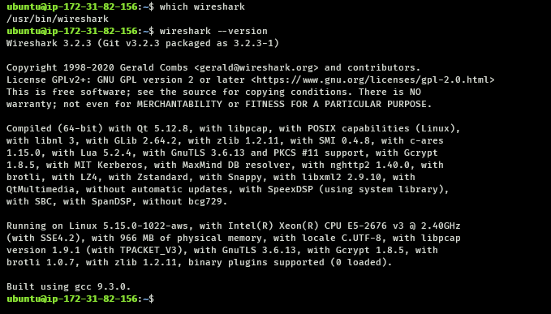
