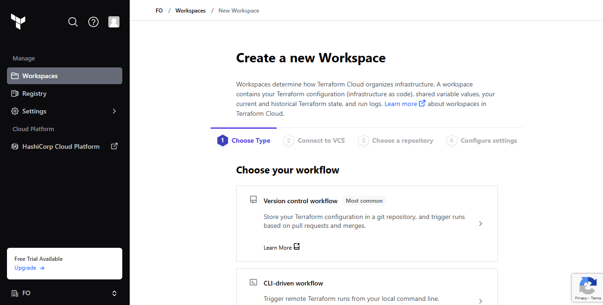

# Automate Infrastructure With IaC using Terraform. Part 4 – Terraform Cloud
### [Here's a link to the terraform-cloud code](https://github.com/franklinobasy/terraform-cloud.git)

Let us explore how we can migrate our codes to Terraform Cloud and manage our AWS infrastructure from there:

1. Create a Terraform Cloud account
Follow [this link](https://app.terraform.io/signup/account), create a new account, verify your email and you are ready to start


2. Create an organization
   Select "Start from scratch", choose a name for your organization and create it.



3. Configure a workspace
   We will use `version control workflow` as the most common and recommended way to run Terraform commands triggered from our git repository.

   Create a new repository in your GitHub and call it terraform-cloud, push your Terraform codes developed in the previous projects to the repository

   Choose version control workflow and you will be promped to connect your GitHub account to your workspace – follow the prompt and add your newly created repository to the workspace.


Move on to "Configure settings", provide a description for your workspace and leave all the rest settings default, click "Create workspace".

4. Configure variables
   Terraform Cloud supports two types of variables: environment variables and Terraform variables. Either type can be marked as sensitive, which prevents them from being displayed in the Terraform Cloud web UI and makes them write-only.

Set two environment variables: `AWS_ACCESS_KEY_ID` and `AWS_SECRET_ACCESS_KEY`, set the values that you used in Project 16. These credentials will be used to privision your AWS infrastructure by Terraform Cloud.


After you have set these 2 environment variables – yout Terraform Cloud is all set to apply the codes from GitHub and create all necessary AWS resources.

5. Now it is time to run our Terrafrom scripts, but in our previous project which was project 18, we talked about using Packer to build our images, and Ansible to configure the infrastructure, so for that we are going to make few changes to our our existing respository from Project 18.
The files that would be Addedd is;

- AMI: for building packer images
- Ansible: for Ansible scripts to configure the infrastucture

Install Packer:
```
curl -fsSL https://apt.releases.hashicorp.com/gpg | sudo apt-key add -

sudo apt-add-repository "deb [arch=amd64] https://apt.releases.hashicorp.com $(lsb_release -cs) main"

sudo apt-get update && sudo apt-get install packer
```

Install Ansible:
```
python3 -m pip install --user ansible
```

In the AMI folder

For each of the following .pkr.hcl files, we run the following commands

```
- packer fmt <name>.pkr.hcl
- packer validate <name>.pkr.hcl
- packer build <name>.pkr.hcl
```


6. Run `terraform plan` and `terraform apply` from web console
Switch to "Runs" tab and click on "Queue plan manualy" button. If planning has been successfull, you can proceed and confirm Apply – press "Confirm and apply", provide a comment and "Confirm plan"


Check the logs and verify that everything has run correctly. Note that Terraform Cloud has generated a unique state version that you can open and see the codes applied and the changes made since the last run.


## Ansible Dynamic Inventory
A dynamic inventory is a script written in Python, PHP, or any other programming language. It comes in handy in cloud environments such as AWS where IP addresses change once a virtual server is stopped and started again.

We make use of dynamic inventory to get Ip address of our servers created based on their tag names and hence we are able to run the required role on each server.

```
ansible-inventory -i inventory/aws_ec2.yml --graph
```