# DEPLOYING APPLICATIONS INTO KUBERNETES CLUSTER

## INTRODUCTION

This project demonstrates how containerised applications are deployed as pods in Kubernetes and how to access the application from the browser.

Create cluster using AWS EKS using the following link [here](https://github.com/weaveworks/eksctl)

```
# create cluster
eksctl create cluster \
  --name project22 \
  --version 1.21 \
  --region us-east-1 \
  --nodegroup-name project22-nodes \
  --node-type t2.micro \
  --nodes 2
```

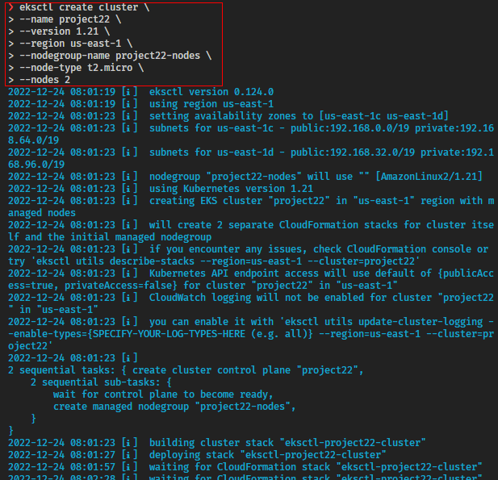

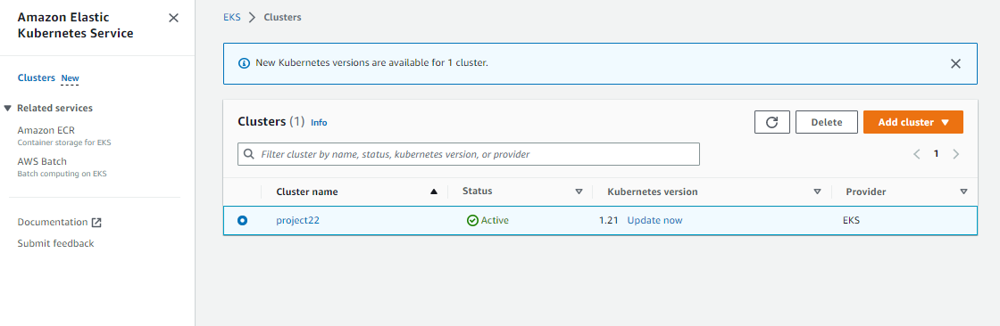

Check nodes (Ec2 Instances) that were created:

```
kubectl get nodes
```

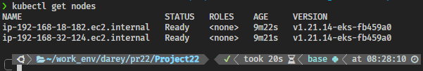

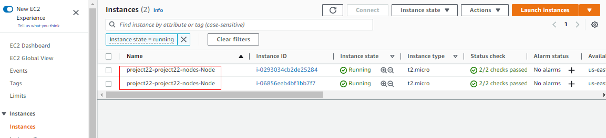

##  STEP 1 - Creating A Pod For The Nginx Application

- Creating nginx pod by applying the manifest file:

`nginx-pod.yaml` manifest file shown below

```
apiVersion: v1
kind: Pod
metadata:
  name: nginx-pod
  labels:
    app: nginx-pod
spec:
  containers:
  - image: nginx:latest
    name: nginx-pod
    ports:
    - containerPort: 80
      protocol: TCP
```

Create the pod:

```
kubectl apply -f nginx-pod.yaml
```

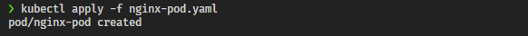

Get information about all pods:

```
kubectl get pods
```

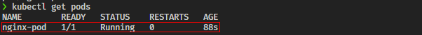

Ger more information about `nginx-pod`

```
kubectl describe pod nginx-pod
```

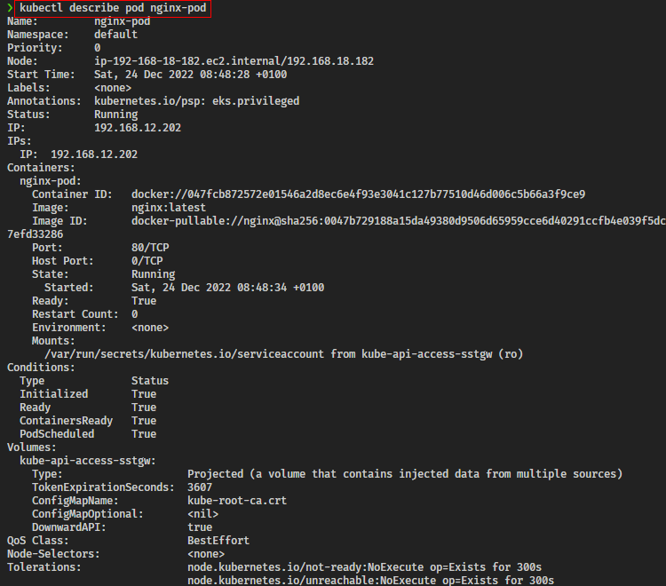

## Step 2 - ACCESSING THE APP FROM THE BROWSER

Now you have a running Pod. What’s next?

The ultimate goal of any solution is to access it either through a web portal or some application (e.g., mobile app). We have a Pod with Nginx container, so we need to access it from the browser. But all you have is a running Pod that has its own IP address which cannot be accessed through the browser. To achieve this, we need another Kubernetes object called Service to accept our request and pass it on to the Pod.

A service is an object that accepts requests on behalf of the Pods and forwards it to the Pod’s IP address. If you run the command below, you will be able to see the Pod’s IP address. But there is no way to reach it directly from the outside world.

`kubectl get pod nginx-pod  -o wide`

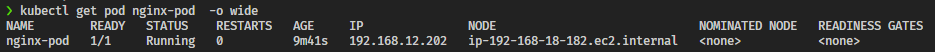

Let us create a service to access the **Nginx Pod**

1. Create a Service yaml manifest file:

```
sudo cat <<EOF | sudo tee ./nginx-service.yaml
apiVersion: v1
kind: Service
metadata:
  name: nginx-service
spec:
  type: NodePort
  selector:
    app: nginx-pod
  ports:
    - protocol: TCP
      port: 80
      nodePort: 30080
EOF
```

2. Create a nginx-service resource by applying your manifest

```
kubectl apply -f nginx-service.yaml
```

Get more information about the service

```
kubectl get service nginx-service -o wide
```

To access the service, you must:

Allow the inbound traffic in your EC2’s Security Group to the NodePort range 30000-32767
Get the public IP address of the node the Pod is running on, append the nodeport and access the app through the browser.
You must understand that the port number 30080 is a port on the node in which the Pod is scheduled to run. If the Pod ever gets rescheduled elsewhere, that the same port number will be used on the new node it is running on. So, if you have multiple Pods running on several nodes at the same time – they all will be exposed on respective nodes’ IP addresses with a static port number.

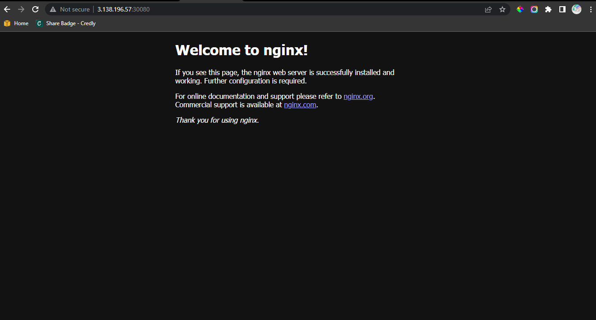

## Step 3 - CREATE A REPLICA SET

Let us create a `rs.yaml` manifest for a ReplicaSet object:

```
apiVersion: apps/v1
kind: ReplicaSet
metadata:
  name: nginx-rs
  labels:
    app: nginx-pod
    tier: frontend
spec:
  replicas: 2
  selector:
    matchLabels:
      tier: frontend
  template:
    metadata:
      name: nginx-pod
      labels:
         app: nginx-pod
         tier: frontend
    spec:
      containers:
      - image: nginx:latest
        name: nginx-pod
        ports:
        - containerPort: 80
          protocol: TCP
```

The manifest file of ReplicaSet consist of the following fields:

- apiVersion: This field specifies the version of kubernetes Api to which the object belongs. ReplicaSet belongs to apps/v1 apiVersion.
- kind: This field specify the type of object for which the manifest belongs to. Here, it is ReplicaSet.
- metadata: This field includes the metadata for the object. It mainly includes two fields: name and labels of the ReplicaSet.
- spec: This field specifies the label selector to be used to select the Pods, number of replicas of the Pod to be run and the container or list of containers which the Pod will run. In the above example, we are running 3 replicas of nginx container.

```
kubectl apply -f rs.yaml
```

Let us check what Pods have been created:

```
kubectl get pods
```

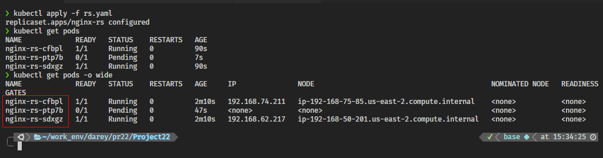

Here we see three ngix-pods with some random suffixes (e.g., -cfpbl) – it means, that these Pods were created and named automatically by some other object (higher level of abstraction) such as ReplicaSet.

Try to delete one of the Pods:

```
kubectl delete pod nginx-rs-cfbpl
```

You can see, that we still have all 3 Pods, but one has been recreated 

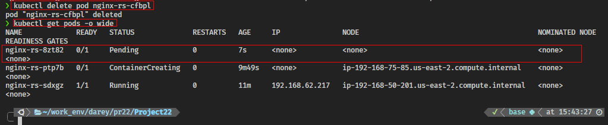

Explore the ReplicaSet created:

```
kubectl get rs -o wide
```
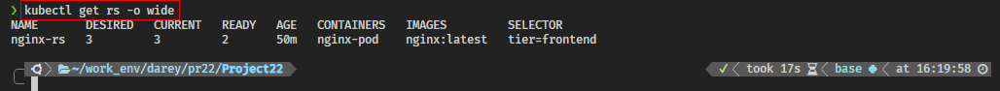

Notice, that ReplicaSet understands which Pods to create by using SELECTOR key-value pair.

### Scale ReplicaSet up and down:
In general, there are 2 approaches of Kubernetes Object Management: 
- imperative and 
- declarative.

Let us see how we can use both to scale our Replicaset up and down:

#### **Imperative**

We can easily scale our ReplicaSet up by specifying the desired number of replicas in an imperative command, like this:

```
kubectl scale rs nginx-rs --replicas=5
```

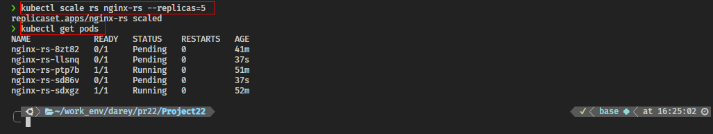
Scaling down will work the same way, so scale it down to 3 replicas.

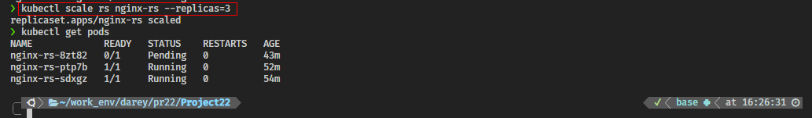

#### **Declarative**

Declarative way would be to open our rs.yaml manifest, change desired number of replicas in respective section

```
spec:
  replicas: 3
```

and applying the updated manifest:

```
kubectl apply -f rs.yaml
```

There is another method – `‘ad-hoc’`, it is definitely not the best practice and we do not recommend using it, but you can edit an existing ReplicaSet with following command:

```
kubectl edit -f rs.yaml
```

#### Advanced label matching
As Kubernetes mature as a technology, so does its features and improvements to k8s objects. ReplicationControllers do not meet certain complex business requirements when it comes to using selectors. Imagine if you need to select Pods with multiple lables that represents things like:

- Application tier: such as Frontend, or Backend
- Environment: such as Dev, SIT, QA, Preprod, or Prod
So far, we used a simple selector that just matches a key-value pair and check only ‘equality’:

```
selector:
  app: nginx-pod
```

But in some cases, we want ReplicaSet to manage our existing containers that match certain criteria, we can use the same simple label matching or we can use some more complex conditions, such as:

```
- in
- not in
- not equal
- etc...
```

Let us look at the following manifest file - `rs.yaml`:

```
apiVersion: apps/v1
kind: ReplicaSet
metadata: 
  name: nginx-rs
spec:
  replicas: 3
  selector:
    matchLabels:
      env: prod
    matchExpressions:
    - { key: tier, operator: In, values: [frontend] }
  template:
    metadata:
      name: nginx
      labels: 
        env: prod
        tier: frontend
    spec:
      containers:
      - name: nginx-container
        image: nginx:latest
        ports:
        - containerPort: 80
          protocol: TCP
```

In the above spec file, under the selector, matchLabels and matchExpression are used to specify the key-value pair. The matchLabel works exactly the same way as the equality-based selector, and the matchExpression is used to specify the set based selectors. This feature is the main differentiator between ReplicaSet and previously mentioned obsolete ReplicationController.

```
kubectl get rs nginx-rs -o wide
```

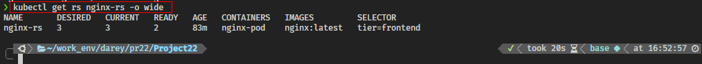

## Step 4 - USING AWS LOAD BALANCER TO ACCESS YOUR SERVICE IN KUBERNETES.

Note: You will only be able to test this using AWS EKS. You don not have to set this up in current project yet. In the next project, you will update your Terraform code to build an EKS cluster.

You have previously accessed the Nginx service through ClusterIP, and NodeIP, but there is another service type – Loadbalancer. This type of service does not only create a Service object in K8s, but also provisions a real external Load Balancer (e.g. Elastic Load Balancer – ELB in AWS)

To get the experience of this service type, update your service manifest and use the LoadBalancer type. Also, ensure that the selector references the Pods in the replica set.

```
# nginx-service.yaml

apiVersion: v1
kind: Service
metadata:
  name: nginx-service
spec:
  type: LoadBalancer
  selector:
    tier: frontend
  ports:
    - protocol: TCP
      port: 80 # This is the port the Loadbalancer is listening at
      targetPort: 80 # This is the port the container is listening at
```

Apply the configuration:
```
kubectl apply -f nginx-service.yaml
```

Get the newly created service :
```
kubectl get service nginx-service
```
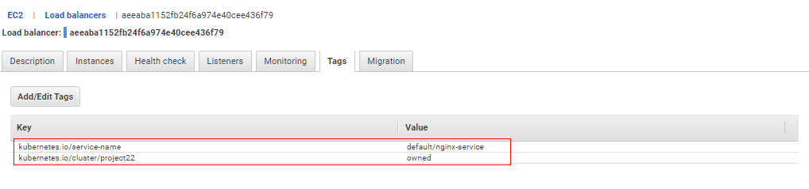

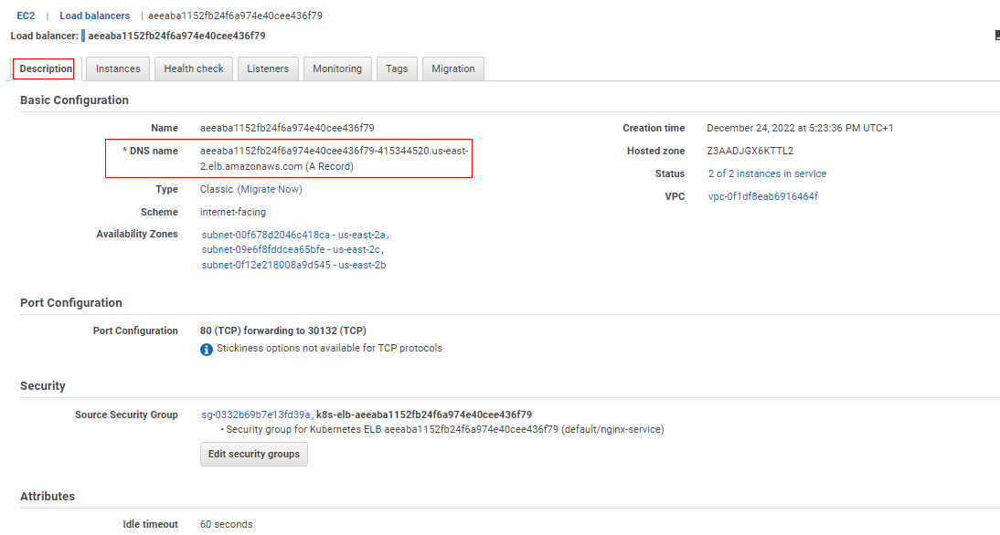

A clusterIP key is updated in the manifest and assigned an IP address. Even though you have specified a Loadbalancer service type, internally it still requires a clusterIP to route the external traffic through.

In the ports section, nodePort is still used. This is because Kubernetes still needs to use a dedicated port on the worker node to route the traffic through. Ensure that port range 30000-32767 is opened in your inbound Security Group configuration.

copy and paste the load balancer dns in your browser

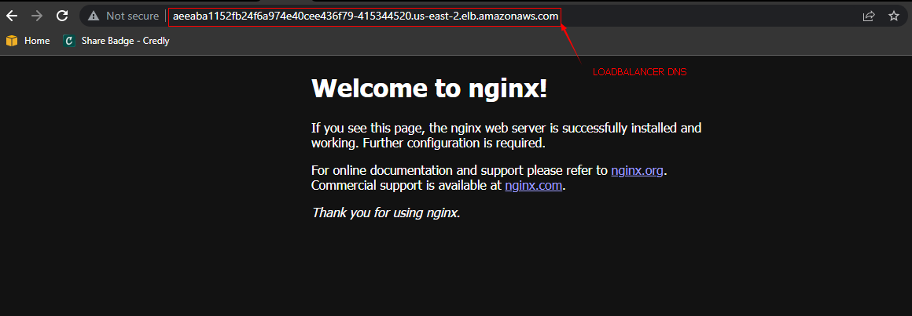

## Step 5 - USING DEPLOYMENT CONTROLLERS

Do not Use Replication Controllers – Use Deployment Controllers Instead
Kubernetes is loaded with a lot of features, and with its vibrant open source community, these features are constantly evolving and adding up.

Previously, you have seen the improvements from ReplicationControllers (RC), to ReplicaSets (RS). In this section you will see another K8s object which is highly recommended over Replication objects (RC and RS).

Delete the ReplicaSet
```
kubectl delete rs nginx-rs
```

Create a  `deployment.yaml` manifest

```
apiVersion: apps/v1
kind: Deployment
metadata:
  name: nginx-deployment
  labels:
    tier: frontend
spec:
  replicas: 3
  selector:
    matchLabels:
      tier: frontend
  template:
    metadata:
      labels:
        tier: frontend
    spec:
      containers:
      - name: nginx
        image: nginx:latest
        ports:
        - containerPort: 80
```
create the deployment using:

```
kubectl apply -f deployment.yaml
```

Run commands to get the following

1. Get the Deployment
    ```
    kubectl get deploy -w
    ```
2. Get the ReplicaSet
    ```
    kubectl get rs
    ```
3. Get the Pods
    ```
    kubectl get pod
    ```
4. Scale the replicas in the Deployment to 15 Pods
    ```
    kubectl scale rs nginx-rs --replicas=15
    ```

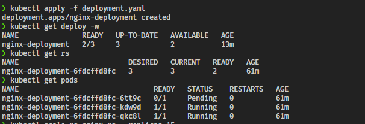


5. Exec into one of the Pod’s container to run Linux commands
   ```
   kubectl exec -it nginx-deployment-6fdcffd8fc-kdw9d bash
   ```

   List the files and folders in the Nginx directory

   ```
   ls -ltr /etc/nginx/
   ```

   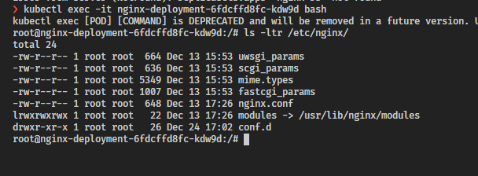


## Step 6 - PERSISTING DATA FOR PODS

Deployments are stateless by design. Hence, any data stored inside the Pod’s container does not persist when the Pod dies.

If you were to update the content of the index.html file inside the container, and the Pod dies, that content will not be lost since a new Pod will replace the dead one.

Let us try that:

Exec into the running container

Install vim so that you can edit the file

```
apt-get update
apt-get install vim
```

Update the content of the file and add the code below `/usr/share/nginx/html/index.html`

```
<!DOCTYPE html>
<html>
<head>
<title>Welcome to DAREY.IO!</title>
<style>
    body {
        width: 35em;
        margin: 0 auto;
        font-family: Tahoma, Verdana, Arial, sans-serif;
    }
</style>
</head>
<body>
<h1>Welcome to DAREY.IO!</h1>
<p>I love experiencing Kubernetes</p>

<p>Learning by doing is absolutely the best strategy at 
<a href="https://darey.io/">www.darey.io</a>.<br/>
for skills acquisition
<a href="https://darey.io/">www.darey.io</a>.</p>

<p><em>Thank you for learning from DAREY.IO</em></p>
</body>
</html>
```

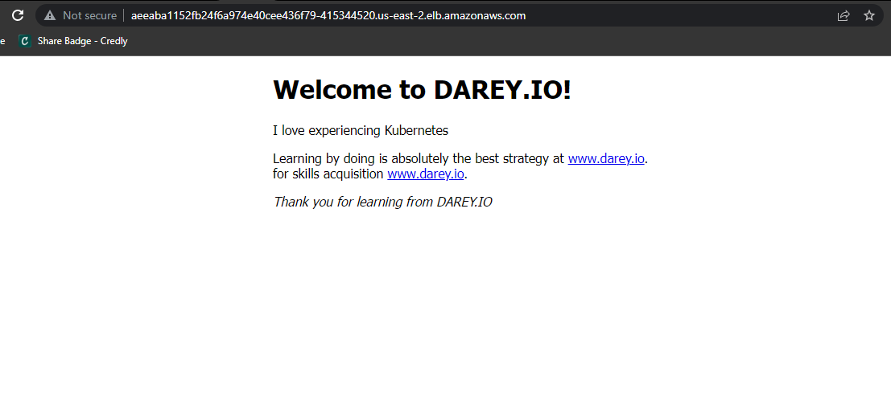
