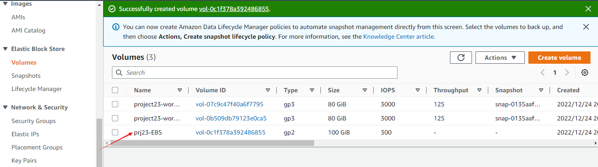

# PERSISTING DATA IN KUBERNETES

The pods created in Kubernetes are ephemeral, they don't run for long. When a pod dies, any data that is not part of the container image will be lost when the container is restarted because Kubernetes is best at managing stateless applications which means it does not manage data persistence. To ensure data persistent, the PersistentVolume resource is implemented to acheive this.

The following outlines the steps:

## STEP 1: Setting Up AWS Elastic Kubernetes Service With EKSCTL

- Downloading and extracting the latest release of eksctl with the following command: 
```
curl --silent --location 
"https://github.com/weaveworks/eksctl/releases/latest/download/eksctl_$(uname -s)_amd64.tar.gz" | tar xz -C /tmp
```

- Moving the extracted binary to /usr/local/bin: 
  
```  
sudo mv /tmp/eksctl /usr/local/bin
```

- Testing the installation was successful with the following command:
``` 
eksctl version
```


- setting up EKS cluster with the command line 

```
eksctl create cluster \
  --name project23 \
  --version 1.21 \
  --region us-east-2 \
  --nodegroup-name worker-nodes \
  --node-type t2.medium \
  --nodes 2
```


## STEP 2: Creating Persistent Volume Manually For The Nginx Application

awsElasticBlockStore
An awsElasticBlockStore volume mounts an Amazon Web Services (AWS) EBS volume into your pod. The contents of an EBS volume are persisted and the volume is only unmmounted when the pod crashes, or terminates. This means that an EBS volume can be pre-populated with data, and that data can be shared between pods.

Lets see what it looks like for our Nginx pod to persist data using awsElasticBlockStore volume

```
sudo cat <<EOF | sudo tee ./nginx-pod.yaml
apiVersion: apps/v1
kind: Deployment
metadata:
  name: nginx-deployment
  labels:
    tier: frontend
spec:
  replicas: 3
  selector:
    matchLabels:
      tier: frontend
  template:
    metadata:
      labels:
        tier: frontend
    spec:
      containers:
      - name: nginx
        image: nginx:latest
        ports:
        - containerPort: 80
EOF
```

Run:

```
kubectl apply -f nginx-pod.yaml
````

**Tasks**

- Verify that the pod is running
- Check the logs of the pod
- Exec into the pod and navigate to the nginx configuration file `/etc/nginx/conf.d`
- Open the config files to see the default configuration.


Describe node where pod is running


- Creating a volume in the Elastic Block Storage section in AWS in the same AZ as the node running the nginx pod which will be used to mount volume into the Nginx pod.




- Updating the deployment configuration with the volume spec and volume mount:

```
apiVersion: apps/v1
kind: Deployment
metadata:
  name: nginx-deployment
  labels:
    tier: frontend
spec:
  replicas: 1
  selector:
    matchLabels:
      tier: frontend
  template:
    metadata:
      labels:
        tier: frontend
    spec:
      containers:
      - name: nginx
        image: nginx:latest
        ports:
        - containerPort: 80
        volumeMounts:
        - name: nginx-volume
          mountPath: /usr/share/nginx/
      volumes:
      - name: nginx-volume
        awsElasticBlockStore:
          volumeID: "vol-0c1f378a392486855"
          fsType: ext4
```

## STEP 3: Managing Volumes Dynamically With PV and PVCs

- PVs are resources in the cluster. PVCs are requests for those resources and also act as claim checks to the resource.By default in EKS, there is a default storageClass configured as part of EKS installation which allow us to dynamically create a PV which will create a volume that a Pod will use.
  
- Verifying that there is a storageClass in the cluster:$ kubectl get storageclass


- Creating a manifest file for a PVC, and based on the gp2 storageClass a PV will be dynamically created:

```
apiVersion: v1
kind: PersistentVolumeClaim
metadata:
    name: nginx-volume-claim
spec:
    accessModes:
    - ReadWriteOnce
    resources:
    requests:
        storage: 2Gi
    storageClassName: gp2
```

- Checking the setup:
- 
`kubectl get pvc`


Checking for the volume binding section:
```
kubectl describe storageclass gp2
```


The PVC created is in pending state because PV is not created yet. Editing the nginx-pod.yaml file to create the PV:

```
apiVersion: apps/v1
kind: Deployment
metadata:
  name: nginx-deployment
  labels:
    tier: frontend
spec:
  replicas: 1
  selector:
    matchLabels:
      tier: frontend
  template:
    metadata:
      labels:
        tier: frontend
    spec:
      containers:
      - name: nginx
        image: nginx:latest
        ports:
        - containerPort: 80
        volumeMounts:
        - name: nginx-volume-claim
          mountPath: /tmp/tony
      volumes:
      - name: nginx-volume-claim
        persistentVolumeClaim:
          claimName: nginx-volume-claim
```

- The '/tmp/folah' directory will be persisted, and any data written in there will be stored permanetly on the volume, which can be used by another Pod if the current one gets replaced.

## STep 4 - Use Of ConfigMap As A Persistent Storage

ConfigMap is an API object used to store non-confidential data in key-value pairs. It is a way to manage configuration files and ensure they are not lost as a result of Pod replacement.
To demonstrate this, the HTML file that came with Nginx will be used.
- Exec into the container and copy the HTML file somewhere else:
```
kubectl exec -it nginx-deployment-5d6cf97577-96hlf bash
cat /usr/share/nginx/html/index.html 
```

- Creating the ConfigMap manifest file and customizing the HTML file and applying the change:

`nginx-configmap.yaml file`

```
apiVersion: v1
kind: ConfigMap
metadata:
  name: website-index-file
data:
  # file to be mounted inside a volume
  index-file: |
    <!DOCTYPE html>
    <html>
    <head>
    <title>Welcome to Nginx!</title>
    <style>
    html { color-scheme: light dark; }
    body { width: 35em; margin: 0 auto;
    font-family: Tahoma, Verdana, Arial, sans-serif; }
    </style>
    </head>
    <body>
    <h1>Welcome to Nginx!</h1>
    <p>If you see this page, the nginx web server is successfully installed and
    working. Further configuration is required.</p>

    <p>For online documentation and support please refer to
    <a href="http://nginx.org/">nginx.org</a>.<br/>
    Commercial support is available at
    <a href="http://nginx.com/">nginx.com</a>.</p>

    <p><em>Thank you for using nginx.</em></p>
    </body>
    </html>
```


- Updating the deployment file to use the configmap in the volumeMounts section

```
apiVersion: apps/v1
kind: Deployment
metadata:
  name: nginx-deployment
  labels:
    tier: frontend
spec:
  replicas: 1
  selector:
    matchLabels:
      tier: frontend
  template:
    metadata:
      labels:
        tier: frontend
    spec:
      containers:
      - name: nginx
        image: nginx:latest
        ports:
        - containerPort: 80
        volumeMounts:
          - name: config
            mountPath: /usr/share/nginx/html
            readOnly: true
      volumes:
      - name: config
        configMap:
          name: website-index-file
          items:
          - key: index-file
            path: index.html
```

Now the index.html file is no longer ephemeral because it is using a configMap that has been mounted onto the filesystem. This is now evident when exec into the pod and list the /usr/share/nginx/html directory

To see the configmap created: `kubectl get configmap`


To see the change in effect, updating the configmap manifest: `kubectl edit cm website-index-file`

```
<!DOCTYPE html>
    <html>
    <head>
    <title>Welcome to ChassTech Services!</title>
    <style>
    html { color-scheme: light dark; }
    body { width: 35em; margin: 0 auto;
    font-family: Tahoma, Verdana, Arial, sans-serif; }
    </style>
    </head>
    <body>
    <h1>Welcome to DAREY.IO!</h1>
    <p>If you see this page, It means you have successfully updated the configMap data Kubernete.</p>

    <p>For online documentation and support please refer to
    <a href="http://DAREY.IO/">DAREY.IO</a>.<br/>
    Commercial support is available at
    <a href="http://DAREY.IO/">DAREY.IO</a>.</p>

    <p><em>Thank you and make sure you are on Darey's Masterclass Program.</em></p>
    </body>
    </html>
```


