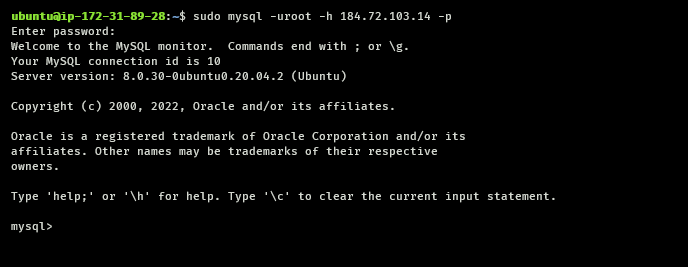

# IMPLEMENT A CLIENT SERVER ARCHITECTURE USING MYSQL DATABASE MANAGEMENT SYSTEM (DBMS).


The following steps will help you demonstrate a basic `client-server` connection using `MySQL` Relational Database Management System (RDBMS).

**Prerequisite**
  - You should know how to create and connect to an EC2 Instance via ssh
  - You should know how to create a custom security group
  - You should know how to edit inbound-rules for security group
  - You show know how to create a user on mysql server

## 1. Create and configure two linux-based server (EC2 instances on AWS)
- Server A name :  `mysql server`


- Server B name :  `mysql client` 


**Note** : Make sure to allow ssh inbound rule connection in the security group for each servers.

---
## 2. Install mysql software on each server
On your local terminal, connect to the servers using ssh.
```
ssh -i "<private-key>" ubuntu@<ip-address>.compute-1.amazonaws.com
```


- Server A -  `mysql server`
  
  For the server side, install mysql-server using the following commands
  ```
  # update package manager index of the server
  sudo apt update

  # install mysql-server package
  sudo apt install mysql-server

  # ensure the server is running using the systemctl command
  sudo systemctl start mysql.service
  sudo systemctl status mysql.service

  ```
  

- Server B - `mysql client`
  
  MySQL Client is a shell. It enable you access and manage MySQL database remotely. In this case, MySQL is not installed on your local machine.
  For the client-side, install mysql-client using the following commands
  ```
  # update package manager index of the server
  sudo apt update

  # install mysql-client package
  sudo apt install mysql-client
  ```

## 3. Open MySQL Server Port on Server A
By default, both of your EC2 virtual servers are located in the same local virtual network, so they can communicate to each other using local IP addresses.

We intend to use mysql server's local IP address to connect from mysql client.

MySQL server uses TCP port 3306 by default, so you will have to open it by creating a new entry in `Inbound rules` in `mysql server` Security Groups. For extra security, do not allow all IP addresses to reach your ‘mysql server’ – allow access only to the specific local IP address of your ‘mysql client’.


## 4. Configure the mysql server to allow connection from remote hosts
- Open mysqld.conf using a text editor
  
  ```
  sudo vi /etc/mysql/mysql.conf.d/mysqld.cnf 
  ```
  change the bind-address from 127.0.0.1 to 0.0.0.0 as shown in the image below

  

- Next, still on mysql server terminal, create a user `root` for the client host and grant the user priveleges.
  
  ```
  sudo mysql -uroot -p
  ```

  ```
  mysql > CREATE USER 'root'@'<ip-address>' IDENTIFIED WITH mysql_native_password BY '<password>';
  ```
  ```
  GRANT ALL PRIVILEGES ON *.* TO 'root'@'<ip_address>';
  ```

- restart mysql service
  ```
  sudo sytemctl restart mysql.service
  ```

## 5. Connect to mysql server from mysql client
 In the mysql client terminal, type the command using the credentials of the user created in step 4

 ```
 sudo mysql -uroot -h <ip-address> -p
 ```

 Enter the password and click enter.

 This invokes the mysql shell as shown below:

 


 Congratulations, You have successfully connected to a remote mysql database server from a client server.