# WEB SOLUTION WITH WORDPRESS

In this project you will be tasked to prepare storage infrastructure on two Linux servers and implement a basic web solution using WordPress. WordPress is a free and open-source content management system written in PHP and paired with MySQL or MariaDB as its backend Relational Database Management System (RDBMS).

Project 6 consists of two parts:

1. Configure storage subsystem for Web and Database servers based on Linux OS. The focus of this part is to give you practical experience of working with disks, partitions and volumes in Linux.

2. Install WordPress and connect it to a remote MySQL database server. This part of the project will solidify your skills of deploying Web and DB tiers of Web solution.


## STEP 1 - EC2 Instance as Web Server
- Launch an EC2 instance that will serve as a web server. Set the name of the EC2 instance as "Project6-Web".
The Linux distribution that will be used is `RedHat`.

  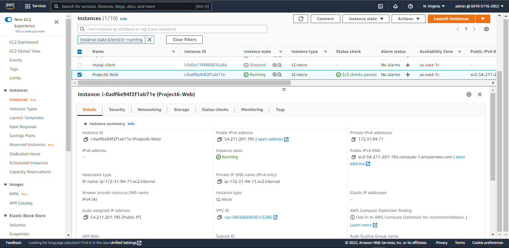

- Connect to the instance via SSH
  
  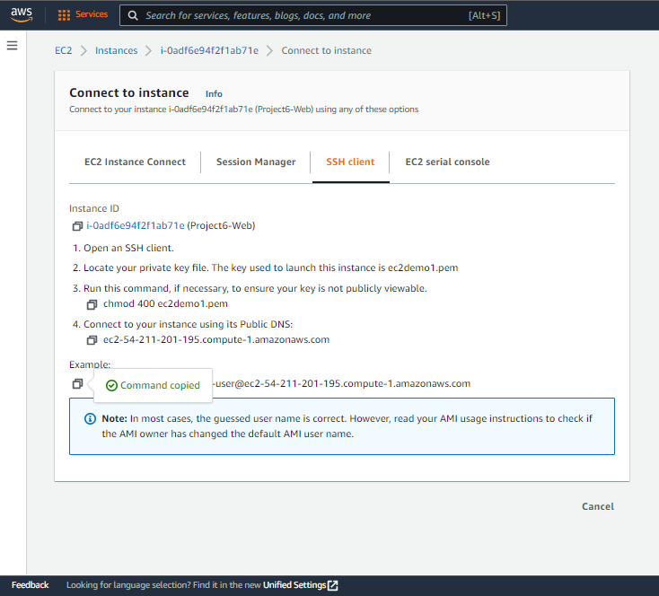

  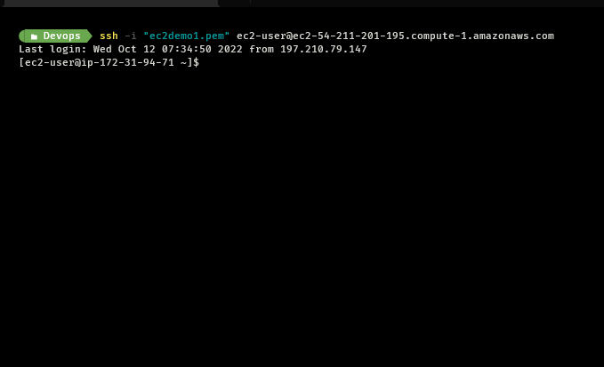

## STEP 2 - Attach Volumes (EBS) to Web Server
In this step, we wil create three volumes in the same Availability Zone (AZ) as the [web server](#step-1---ec2-instance-as-web-server), and attach them to the [web server](#step-1---ec2-instance-as-web-server). The following step will guide you to create an EBS:

1. On the EC2 page, go to the side panel, stroll down to the Elastic Block Store (EBS) category and select `Volumes`.

   

2. After selecting `Volumes`, Click `Create volume` on the top-right corner of the page.
    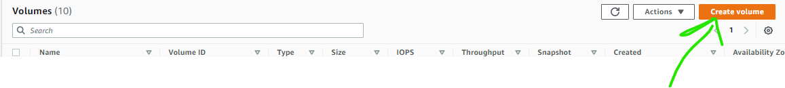

3. In the `Create volume` configuration page, choose a size of 10GiB. Set the AZ to be the same as your [web server](#step-1---ec2-instance-as-web-server), in my own case, I selected `us-east-1c`. Then click `Create volume` button at the bottom of the form.
    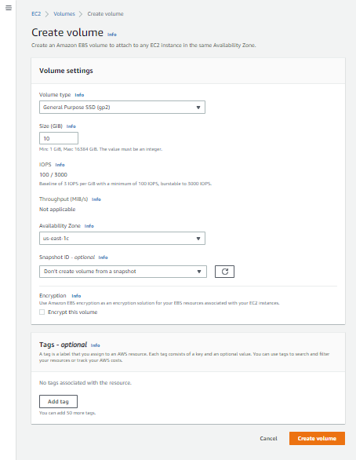

4. After successfully creating the volume, your result show look like the one below:
    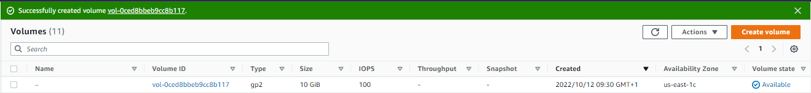

5. Since we need 3 volumes for this project, go ahead and repeat the steps above to create two other new volumes.
   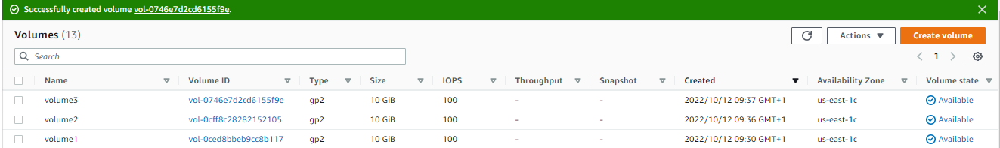

   in the image above I created two other volumes, and also rename the three volumes respectively to `volume1`, `volume2` and `volume3`.

6. Next, we will attach all three volumes to the EC2 insatnce (Project6-web) which is serving as our `web server`
   - select `volume1`, click `Actions` on the top right corner.
      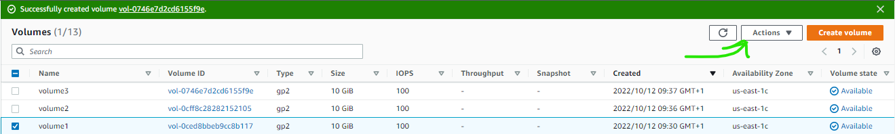

   - Then select `Attach volume`
     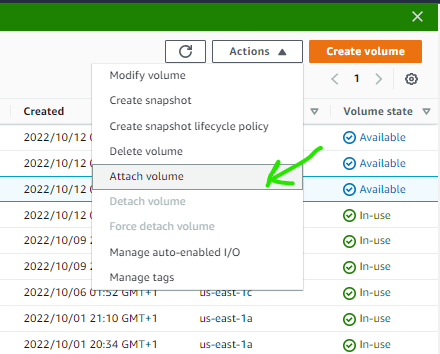

   - In the instane option, choose the Project6-web instance, and set the `Device name` as `/dev/xvdf`.
     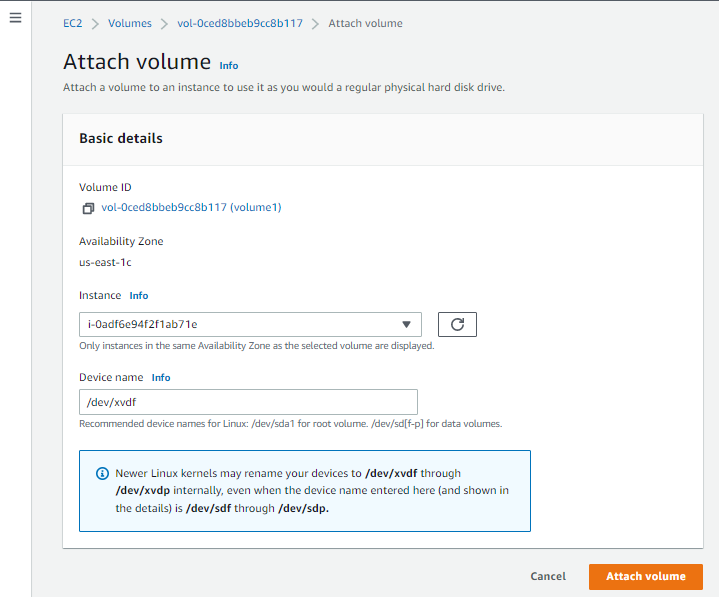

   - Then, click `Attach volume`.
     After successfully attaching `volume1`, you will notice that it's `Volume state` now appears to be `in use`.
     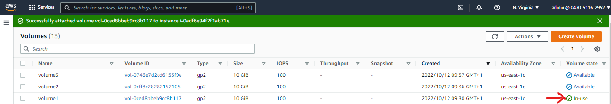

   - Do the same for `volume2` and `volume3`, attach them to the `Project6-web` instance and set their respective `Device name` to `/dev/xvdg` for `volume2` and `/dev/xvdh` for `volume3`.
   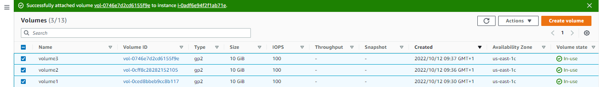
   
7. Now that we have attached the volumes to the web server instance, let's configure them on the Linux terminal (remember, we SSH to the instance [here](#step-1---ec2-instance-as-web-server) to have access to the linux terminal).
   

8. Use ```lsblk``` command to inspect what block devices are attached to the server. Notice names of your newly created devices. All devices in Linux reside in /dev/ directory. Inspect it with ls /dev/ and make sure you see all 3 newly created block devices there.
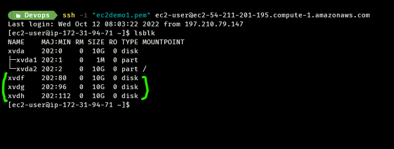

9. Use `df -h` command to see all mounts and free space on your server.
    
10. Use `gdisk` utility to create a single partition on each of the 3 disks
    ```
    sudo gdisk /dev/xvdf
    ```
    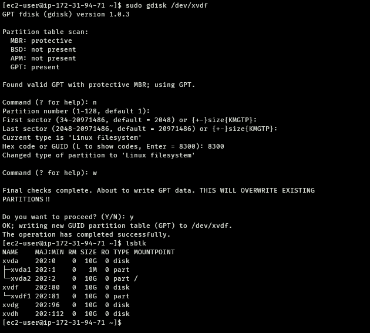

    do the same for the other volumes.
    ```
    sudo gdisk /dev/xvdg
    ```
    ```
    sudo gdisk /dev/xvdh
    ```

11. Use `lsblk` utility to view the newly configured partition on each of the 3 disks.
    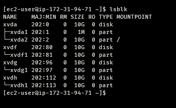

12. Install `lvm2` package using 
    ```
    sudo yum install lvm2
    ```
    Run sudo `lvmdiskscan` command to check for available partitions.

13. Use `pvcreate` utility to mark each of 3 disks as physical volumes (PVs) to be used by LVM
    ```
    sudo pvcreate /dev/xvdf1
    sudo pvcreate /dev/xvdg1
    sudo pvcreate /dev/xvdh1
    ```
    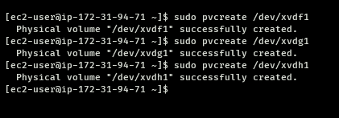

    Verify that your Physical volume has been created successfully by running 
    ```bash
    sudo pvs
    ```
    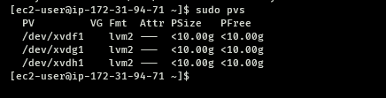

14. Use `vgcreate` utility to add all 3 PVs to a volume group (VG). Name the VG `webdata-vg`
    ```
    sudo vgcreate webdata-vg /dev/xvdh1 /dev/xvdg1 /dev/xvdf1
    ```
    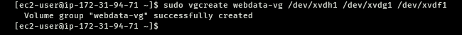

    Verify that your VG has been created successfully by running 
    ```
    sudo vgs
    ```
    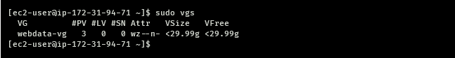


13. Use `lvcreate` utility to create 2 logical volumes. `apps-lv` (Use half of the PV size), and `logs-lv` Use the remaining space of the PV size. NOTE: apps-lv will be used to store data for the Website while, logs-lv will be used to store data for logs.
    ```
    sudo lvcreate -n apps-lv -L 14G webdata-vg
    sudo lvcreate -n logs-lv -L 14G webdata-vg
    ```
    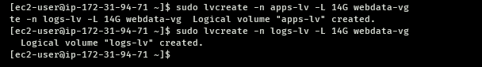

    Verify that your Logical Volume has been created successfully by running 
    ```
    sudo lvs
    ```
    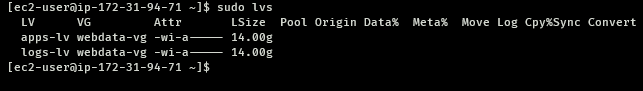

14. Verify the entire setup
    ```
    sudo vgdisplay -v #view complete setup - VG, PV, and LV
    sudo lsblk 
    ```
    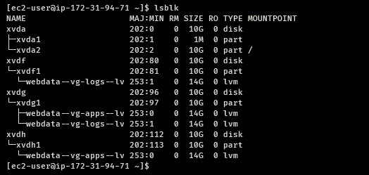

15. Use `mkfs.ext4` to format the logical volumes with `ext4` filesystem
    ```
    sudo mkfs -t ext4 /dev/webdata-vg/apps-lv
    sudo mkfs -t ext4 /dev/webdata-vg/logs-lv
    ```
    

16. Create `/var/www/html` directory to store website files
    ```
    sudo mkdir -p /var/www/html
    ```

17. Create `/home/recovery/logs` to store backup of log data
    ```
    sudo mkdir -p /home/recovery/logs
    ```

18. Mount `/var/www/html` on `apps-lv` logical volume
    ```
    sudo mount /dev/webdata-vg/apps-lv /var/www/html/
    ```

19. Use `rsync` utility to backup all the files in the log directory `/var/log` into `/home/recovery/logs` 
    
    **(This is required before mounting the file system)**
    ```
    sudo rsync -av /var/log/. /home/recovery/logs/
    ```

20. Mount `/var/log` on `logs-lv` logical volume. 
    
    **(Note that all the existing data on `/var/log` will be deleted. That is why step 19 above is very important)**

    ```
    sudo mount /dev/webdata-vg/logs-lv /var/log
    ```

21. Restore log files back into `/var/log` directory
    ```
    sudo rsync -av /home/recovery/logs/. /var/log
    ```

In the next step, we will update `/etc/fstab` file so that the mount configuration will persist after restart of the server.

## STEP 3 - UPDATE THE `/ETC/FSTAB` FILE

The UUID of the device will be needed in order to update the `/etc/fstab` file.

run the command to obtaain the UUID of the deevice:
```
sudo blkid
```
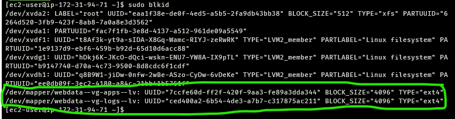

edit `/etc/fstab` file
```
sudo vi /etc/fstab
```

update `/etc/fstab` with the UUIDs using the format shown below:

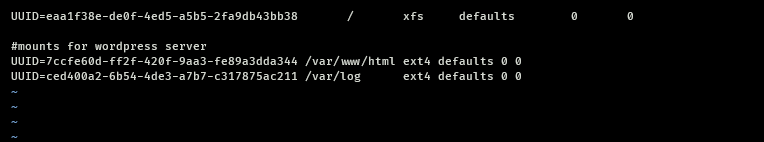

- Test the configuration and reload the daemon
  ```
  sudo mount -a
  sudo systemctl daemon-reload
  ```

- Verify your setup by running `df -h`, output must look like this:
  
  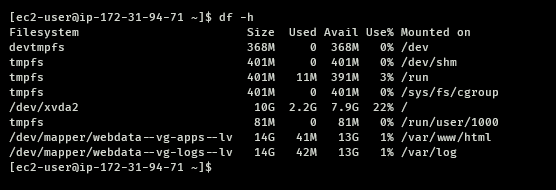

## STEP 3 - Prepare the Database Server

Launch a second RedHat EC2 instance that will have a role – `DB Server`

Repeat the same steps as for the Web Server, but instead of `apps-lv` create `db-lv` and mount it to `/db` directory instead of `/var/www/html/`.

## STEP 4 - Install WordPress on your Web Server EC2
1. Update the repository
   ```
   sudo yum -y update
   ```
2. Install wget, Apache and it’s dependencies
   ```
   sudo yum -y install wget httpd php php-mysqlnd php-fpm php-json
   ```
3. Start Apache
   ```
   sudo systemctl enable httpd
   sudo systemctl start httpd

   ```
4. install PHP and it’s depemdencies
   ```
   sudo yum install https://dl.fedoraproject.org/pub/epel/epel-release-latest-8.noarch.rpm
   sudo yum install yum-utils http://rpms.remirepo.net/enterprise/remi-release-8.rpm
   sudo yum module list php
   sudo yum module reset php
   sudo yum module enable php:remi-7.4
   sudo yum install php php-opcache php-gd php-curl php-mysqlnd
   sudo systemctl start php-fpm
   sudo systemctl enable php-fpm
   sudo setsebool -P httpd_execmem 1
   ```
5. Restart Apache
   ```
   sudo systemctl restart httpd
   ```

6. Download wordpress and copy wordpress to var/www/html
   ```
   mkdir wordpress
   cd   wordpress
   sudo wget http://wordpress.org/latest.tar.gz
   sudo tar xzvf latest.tar.gz
   sudo rm -rf latest.tar.gz
   sudo cp wordpress/wp-config-sample.php wordpress/wp-config.php
   sudo cp -R wordpress /var/www/html/
   ```

7. Configure SELinux Policies
   ```
   sudo chown -R apache:apache /var/www/html/wordpress
   sudo chcon -t httpd_sys_rw_content_t /var/www/html/wordpress -R
   sudo setsebool -P httpd_can_network_connect=1
   ```

## STEP 5 - Install MySQL on your DB Server EC2

```
sudo yum update
sudo yum install mysql-server
```

Verify that the service is up and running by using `sudo systemctl status mysqld`, if it is not running, restart the service and enable it so it will be running even after reboot:

```
sudo systemctl restart mysqld
sudo systemctl enable mysqld
```

## STEP 6 — Configure DB to work with WordPress
1. start `mysql` shell on the DB Server instance
    ```
    sudo mysql
    ```

2. Run the following SQL commands
   ```
   CREATE DATABASE wordpress;
   CREATE USER `myuser`@`<Web-Server-Private-IP-Address>` IDENTIFIED BY 'mypass';
   GRANT ALL ON wordpress.* TO       'myuser'@'<Web-Server-Private-IP-Address>';
   FLUSH PRIVILEGES;
   SHOW DATABASES;
   exit
   ```
   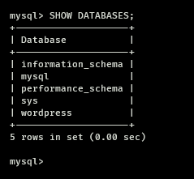


## STEP 7 - Configure WordPress to connect to remote database.
**Hint**: Do not forget to open MySQL port 3306 on DB Server EC2. For extra security, you shall allow access to the DB server ONLY from your Web Server’s IP address, so in the Inbound Rule configuration specify source as /32

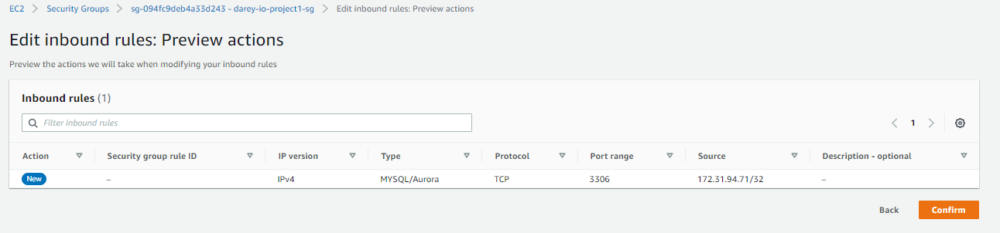

1. Install MySQL client and test that you can connect from your Web Server to your DB server by using mysql-client
   ```
   sudo yum install mysql
   sudo mysql -u myuser -p -h <DB-Server-Private-IP-address>
   ```
   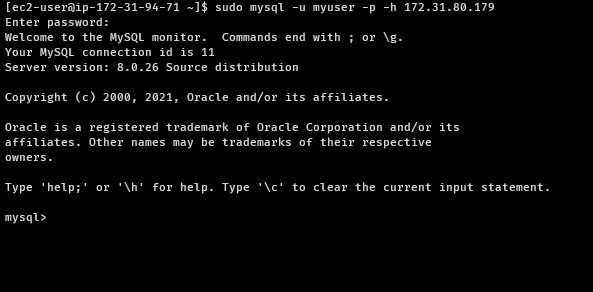

2. Verify if you can successfully execute `SHOW DATABASES;` command and see a list of existing databases.
   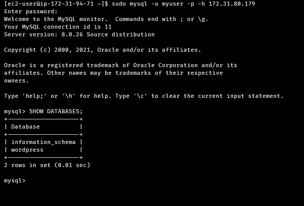

3. Change permissions and configuration so Apache could use WordPress:
   - Enable TCP port 80 in Inbound Rules configuration for your Web Server EC2 (enable from everywhere 0.0.0.0/0 or from your workstation’s IP)
   