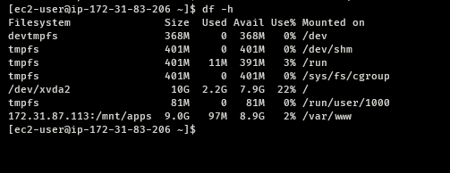

# DEVELOPING TOOLING WEBSITE SOLUTION

## STEP 1 - Prepare NFS Server
1. Spin up a new EC2 instance with RHEL Linux 8 Operating System.
   

2. Based on your LVM experience from [`Project 6`](https://github.com/franklinobasy/Devops/blob/main/project6.md), Configure LVM on the Server.
     

   - Ensure there are 3 Logical Volumes. `lv-opt`, `lv-apps`, and `lv-logs`
     ```bash
     sudo lvcreate -n lv-opt -L 14G webdata-vg
     sudo lvcreate -n lv-apps -L 14G webdata-vg
     sudo lvcreate -n lv-logs -L 14G webdata-vg
     ``` 
     
     

    - Instead of formating the disks as ext4 you will have to format the
      as xfs
      ```bash
      sudo mkfs -t xfs /dev/webdata-vg/lv-opt
      sudo mkfs -t xfs /dev/webdata-vg/lv-apps
      sudo mkfs -t xfs /dev/webdata-vg/lv-logs
      ```
      

     - Create mount points on /mnt directory for the logical volumes
       as follow:
       Mount lv-apps on /mnt/apps – To be used by webservers
       Mount lv-logs on /mnt/logs – To be used by webserver logs
       Mount lv-opt on /mnt/opt – To be used by Jenkins server in Project 8
       ```
       # create directories
       sudo mkdir -p /mnt/apps
       sudo mkdir -p /mnt/logs
       sudo mkdir -p /mnt/opt

       # for logs backup
       sudo mkdir -p /home/recovery/logs

       # mount
       sudo mount /dev/webdata-vg/lv-apps /mnt/apps
       sudo mount /dev/webdata-vg/lv-opt /mnt/opt

       sudo rsync -av /mnt/logs/. /home/recovery/logs/

       sudo mount /dev/webdata-vg/lv-logs /mnt/logs

       sudo rsync -av /home/recovery/logs/. /mnt/logs/
       ```
       

      - Install NFS server, configure it to start on reboot and make sure
        it is up and running
        ```
        sudo yum -y update
        sudo yum install nfs-utils -y
        sudo systemctl start nfs-server.service
        sudo systemctl enable nfs-server.service
        sudo systemctl status nfs-server.service
        ```
       - Export the mounts for webservers’ subnet cidr to connect as
         clients. For simplicity, you will install your all three Web Servers inside the same subnet, but in production set up you would probably want to separate each tier inside its own subnet for higher level of security.
         To check your subnet cidr – open your EC2 details in AWS web console and locate ‘Networking’ tab and open a Subnet link:

         
         

         Make sure you setup permission that will allow the web servers to read, write and execute files on NFS
         ```
         sudo chown -R nobody: /mnt/apps
         sudo chown -R nobody: /mnt/logs
         sudo chown -R nobody: /mnt/opt

         sudo chmod -R 777 /mnt/apps
         sudo chmod -R 777 /mnt/logs
         sudo chmod -R 777 /mnt/opt
         ```
        - Configure access to NFS for clients within the same subne
          (example of Subnet CIDR - 172.31.80.0/20)
          ```
          sudo vi /etc/exports
          ```
          copy the following to the file
          ```
          /mnt/apps <Subnet-CIDR>(rw,sync,no_all_squash,no_root_squash)
          /mnt/logs <Subnet-CIDR>(rw,sync,no_all_squash,no_root_squash)
          /mnt/opt <Subnet-CIDR>(rw,sync,no_all_squash,no_root_squash)

          ```

          Run the command
          ```
          sudo exportfs -arv
          ```
        - Check which port is used by NFS and open it using Security Groups
          (add new Inbound Rule)
          ```
          rpcinfo -p | grep nfs
          ```

          Important note: In order for NFS server to be accessible from your client, you must also open following ports: TCP 111, UDP 111, UDP 2049

          

## STEP 2 - CONFIGURE THE DATABASE SERVER
Install and configure a MySQL DBMS to work with remote Web Server
- Install MySQL server
  ```
  sudo yum install mysql-server
  ```

- Create a database and name it tooling
  ```
  sudo systemctl start mysqld

  sudo mysql
  ```
  ```
  mysql> CREATE DATABASE tooling;
  ```
 - Create a database user and name it webaccess
   ```
   mysql> CREATE USER 'webaccess'@'172.31.80.0/20' IDENTIFIED BY 'password';
   ```
 - Grant permission to webaccess user on tooling database to do anything
   only from the webservers subnet cidr
   ```
   mysql> GRANT ALL PRIVILEGES ON tooling.* TO 'webaccess'@'172.31.80.0/20' WITH GRANT OPTION;

   mysql> FLUSH PRIVILEGES;
   ``` 
  
## STEP 3 - Prepare the Web Servers
We need to make sure that our Web Servers can serve the same content from shared storage solutions, in our case – NFS Server and MySQL database.
You already know that one DB can be accessed for reads and writes by multiple clients. For storing shared files that our Web Servers will use – we will utilize NFS and mount previously created Logical Volume lv-apps to the folder where Apache stores files to be served to the users (/var/www).

This approach will make our Web Servers stateless, which means we will be able to add new ones or remove them whenever we need, and the integrity of the data (in the database and on NFS) will be preserved.

During the next steps we will do following:
- Configure NFS client (this step must be done on all three servers)
- Deploy a Tooling application to our Web Servers into a shared NFS folder
- Configure the Web Servers to work with a single MySQL database
  
1. Launch a new EC2 instance with RHEL 8 Operating System
   

2. Install NFS Client
   ```
   sudo yum install nfs-utils nfs4-acl-tools -y
   ```
   

3. Mount `/var/www/` and target the NFS server’s export for apps
   ```
   sudo mkdir /var/www
   sudo mount -t nfs -o rw,nosuid <NFS-Server-Private-IP-Address>:/mnt/apps /var/www
   ```
4. Verify that NFS was mounted successfully by running `df -h`. Make sure
   that the changes will persist on Web Server after reboot:

   

   ```
   sudo vi /etc/fstab
   ```
   add the following line
   ```
   <NFS-Server-Private-IP-Address>:/mnt/apps /var/www nfs defaults 0 0
   ```
5. Install [`Remi’s repository`](http://www.servermom.org
   how-to-enable-remi-repo-on-centos-7-6-and-5/2790/), Apache and PHP
   ```
   sudo yum install httpd -y

   sudo yum -y install https://dl.fedoraproject.org/pub/epel/epel-release-latest-8.noarch.rpm

   sudo yum -y install https://rpms.remirepo.net/enterprise/remi-release-8.rpm

   sudo dnf -y install dnf-utils

   sudo dnf module reset php

   sudo dnf module enable php:remi-7.4

   sudo dnf install php php-opcache php-gd php-curl php-mysqlnd

   sudo systemctl start php-fpm

   sudo systemctl enable php-fpm

   sudo setsebool -P httpd_execmem 1
   ```
   ** Repeat steps 1-5 for another 2 Web Servers. **

6. Verify that Apache files and directories are available on the Web Server
  in /var/www and also on the NFS server in /mnt/apps. If you see the same files – it means NFS is mounted correctly. You can try to create a new file touch test.txt from one server and check if the same file is accessible from other Web Servers.

7. Locate the log folder for Apache on the Web Server and mount it to NFS
   server’s export for logs. Repeat step №4 to make sure the mount point will persist after reboot.

8. Fork the tooling source code from [`Darey.io Github Account`](https://github.com/darey-io/tooling.git) to your Github account.

9. Deploy the tooling website’s code to the Webserver. Ensure that the html folder from the repository is deployed to /var/www/html
    
10. Update the website’s configuration to connect to the database (in /var/www/html/functions.php file). Apply tooling-db.sql script to your database using this command 
    ```
    mysql -h <databse-private-ip> -u <db-username> -p <db-pasword> < tooling-db.sql
    ```

11. Create in MySQL a new admin user with username: myuser and password: password:
    ```
    INSERT INTO `users` (`id`, `username`, `password`, `email`, `user_type`, `status`) VALUES (2, 'myuser', '5f4dcc3b5aa765d61d8327deb882cf99', 'user@mail.com', 'admin', '1');
    ```

12. Open the website in your browser http://<Web-Server-Public-IP-Address-or-Public-DNS-Name>/index.php and make sure you can login into the websute with myuser user.
    


**Congratulations!**

You have just implemented a web solution for a DevOps team using LAMP stack with remote Database and NFS servers.